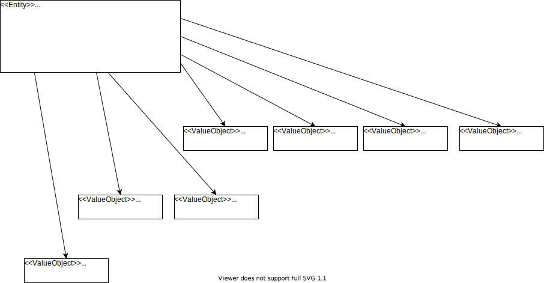

You want to know how to apply and implement Domain-Driven Design? You’re looking for a real world example? Great, you’ve found it! The idea of the LeasingNinja is to have one domain that is small enough to be grasped easily and big enough to show the different DDD[^ddd-jargon] concepts in a real world end-to-end example.

[^ddd-jargon]: I assume some familiarity with the DDD jargon. To get that or for a refresh have a look at Eric Evans’s [*DDD Reference*](https://www.domainlanguage.com/ddd/reference/).

**WARNING:** The LeasingNinja is currently in a state of early alpha.
I still hope it can already be of some help.

There will be different *incarnations* (i.e. implementations) of the LeasingNinja to show the pros and cons of different styles and solutions. By always using the same domain the details of the various incarnations can be compared easily. Each incarnation is a combination of styles.

We use different styles in: strategic design, implementation of the domain “layer,” programming language, and other properties of programming.
Strategic stuff contains big ball of mud versus bounded contexts vs CQRS.
Domain layer: domain model vs anemic domain model vs polluted domain model vs event sourced domain model.
For programming languages the Java version is developed the farthest.
There are also beginning implementations in PHP, Swift, Python.
Other languages will follow eventually.

All incarnations are accessible for everyone under MIT license on GitHub. Some of the better incarnations are meant to serve as blueprint for new projects. The worse incarnations are examples of “how to *not* do it.” Be warned to use them as blueprints...

## Ok, Show Me the Code!

Not so fast young padawan! The first D in DDD stands for Domain and one important rule is that we have to at least some understanding of the domain before we start coding. (If you want to ignore this warning you can easily jump forward to the incarnations [here](https://www.github.com/leasingninja)).

## So, What Is the Domain in our Example?

Imagine Bob wants to reduce his carbon footprint. He likes to change his dirty gas-powered car for a clean new electric car. Unfortunately he doesn’t have a lot of money. But the salesperson at the car dealer says: “No problem: we buy the car for you and rent it to you for a monthly rate (installment).” This is called *leasing*. “Great,” says Bob, “How much will it cost me per month?” The salesperson calculates the monthly rate. Bob signs the contract and the salesperson gives the contract into the risk department. There a risk manager looks at Bob’s credit rating and decides that it is good enough. So he votes the contract with “yes.” Only now the contract becomes legally valid. He informs the salesperson and she gives the keys to Bob.

Phew, this is a lot of text!
Let's model it in a more graphical way—a Domain Story.

<video width="640" height="480" preload autoplay loop>
  <source src="resources/domainstory-leasingninja.mp4" type="video/mp4"/>
  
Your browser does not support the video tag and cannot show the domain story.

</video>

In this coarse-grained domain story we get an overview about what is happening in our domain.
Also we can see a lot of words of the domain language.
Verbs like “to sign” and “to vote,” nouns like “contract,” “monthly rate,” and “credit rating.”
All of them will become parts of our ubiquitous language.

Now that we gained some understanding of the domain, let's see if we can find some context boundaries!
Looking at our domain story we can see interaction between the customer and the salesperson in the left part.
And there is work the risk manager is doing on her own.
Considering this we find two bounded contexts:

There is the “Sales” context and the “Risk Management” context.
We extract them from the domain story to draw the context map:

## Going Deeper Into the Details

The next step is to drill deeper into the single bounded contexts.
Lets start with “Sales”:

In this finer grained domain story we can find elements for our domain model.
As rule of thumb we take:

- the work objects and make classes out of them
- the activities and turn them into methods/commands

This leads us to the following domain model:

## Finally Let’s Write Some Code

The bounded contexts and domain models we have found can be implemented in different ways.

Currently there are the following incarnations:

| Language | Architecture                                        | Technology | Sources |
| -------- | --------------------------------------------------- | ---------- | ------- |
| Java     | Strategic: Bounded Contexts, Tactical: Domain Model | UI: Spring WebMVC, Persistence: Hibernate | <https://github.com/leasingninja/leasingninja-java-boundedcontexts-domainmodel> |
| PHP      | Strategic: Bounded Contexts, Tactical: Domain Model | | <https://github.com/leasingninja/leasingninja-php-boundedcontexts-domainmodel> |
| Python   | Strategic: Bounded Contexts, Tactical: Domain Model | | <https://github.com/leasingninja/leasingninja-python-boundedcontexts-domainmodel> |
| Swift    | Strategic: Bounded Contexts, Tactical: Domain Model | | <https://github.com/leasingninja/leasingninja-swift-boundedcontexts-domainmodel> |
| C#       | Strategic: Bounded Contexts, Tactical: Domain Model | | <https://github.com/leasingninja/leasingninja-csharp-boundedcontexts-domainmodel> |
